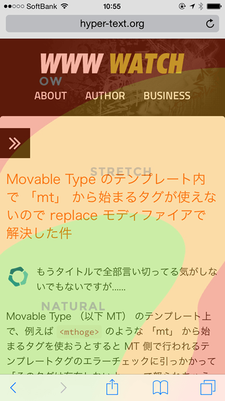
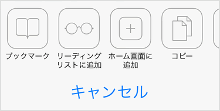
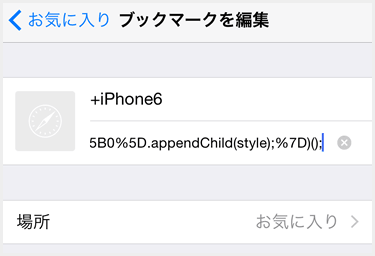

# Overlay Thumb Zone map bookmarklet for iOS Safari

iPhone Safari で [Thumb Zone map](http://scotthurff.com/posts/how-to-design-for-thumbs-in-the-era-of-huge-screens) を閲覧中の画面にオーバーレイ表示するブックマークレット。

## 使い方

基本的な使い方は通常のブックマークレットと同じです。

### ブックマークレットの登録

まず一度このページ（実際にはどこでもいいです）をブックマークに追加してください。

次に下記のブックマークレット一覧から、使いたいブックマークレットのソースコードをコピーします。

ソースコードをコピーしたら、ブックマークの管理画面から先ほど追加したブックマークの編集に進みます。

URL の部分を一旦すべて削除した上で、先ほどコピーした内容をペーストして保存します。ブックマークのタイトルも任意でわかりやすく変更しておくとよいでしょう。

閲覧中のページでブックマークからブックマークレットを起動すると、画面上に Thumb Zone map がオーバーレイ表示されます。

#### ブックマークレット一覧

上記の使い方を参考にブックマークに登録してください。

##### iPhone 4

    javascript:(function(){var style=document.createElement('style');var head=document.getElementsByTagName('head');style.setAttribute('type','text/css');style.innerHTML='body::after{content:url(//burnworks.com/docs/thumb_zone_map/iphone-4.jpg);position:fixed;top:0;left:0;opacity:.4;-webkit-transform:scale(.5);-webkit-transform-origin:0 0;transform:scale(.5);transform-origin:0 0;z-index:1000;}';head[0].appendChild(style);})();

##### iPhone 5

    javascript:(function(){var style=document.createElement('style');var head=document.getElementsByTagName('head');style.setAttribute('type','text/css');style.innerHTML='body::after{content:url(//burnworks.com/docs/thumb_zone_map/iphone-5.jpg);position:fixed;top:0;left:0;opacity:.4;-webkit-transform:scale(.5);-webkit-transform-origin:0 0;transform:scale(.5);transform-origin:0 0;z-index:1000;}';head[0].appendChild(style);})();

##### iPhone 6

    javascript:(function(){var style=document.createElement('style');var head=document.getElementsByTagName('head');style.setAttribute('type','text/css');style.innerHTML='body::after{content:url(//burnworks.com/docs/thumb_zone_map/iphone-6.jpg);position:fixed;top:0;left:0;opacity:.4;-webkit-transform:scale(.5);-webkit-transform-origin:0 0;transform:scale(.5);transform-origin:0 0;z-index:1000;}';head[0].appendChild(style);})();

##### iPhone 6 (choke-up)

    javascript:(function(){var style=document.createElement('style');var head=document.getElementsByTagName('head');style.setAttribute('type','text/css');style.innerHTML='body::after{content:url(//burnworks.com/docs/thumb_zone_map/iphone-6-choke-up.jpg);position:fixed;top:0;left:0;opacity:.4;-webkit-transform:scale(.5);-webkit-transform-origin:0 0;transform:scale(.5);transform-origin:0 0;z-index:1000;}';head[0].appendChild(style);})();

##### iPhone 6 plus

    javascript:(function(){var style=document.createElement('style');var head=document.getElementsByTagName('head');style.setAttribute('type','text/css');style.innerHTML='body::after{content:url(//burnworks.com/docs/thumb_zone_map/iphone-6-plus.jpg);position:fixed;top:0;left:0;opacity:.4;-webkit-transform:scale(.5);-webkit-transform-origin:0 0;transform:scale(.5);transform-origin:0 0;z-index:1000;}';head[0].appendChild(style);})();

##### iPhone 6 plus (choke-up)

    javascript:(function(){var style=document.createElement('style');var head=document.getElementsByTagName('head');style.setAttribute('type','text/css');style.innerHTML='body::after{content:url(//burnworks.com/docs/thumb_zone_map/iphone-6-plus-choke-up.jpg);position:fixed;top:0;left:0;opacity:.4;-webkit-transform:scale(.5);-webkit-transform-origin:0 0;transform:scale(.5);transform-origin:0 0;z-index:1000;}';head[0].appendChild(style);})();

## その他

下記のページで本ブックマークレットについての解説記事を書いています。参考まで。

* [閲覧中の Web ページ に Thumb Zone Map （親指が届く範囲マップ） をオーバーレイ表示するブックマークレットを作った](http://hyper-text.org/archives/2014/09/bookmarklet_thumb_zone_map.shtml)

### Thumb Zone Templates

Thumb Zone Templates by [Scott Hurff](http://scotthurff.com/) is licensed under a [Creative Commons Attribution-NonCommercial-ShareAlike 4.0 International License](http://creativecommons.org/licenses/by-nc-sa/4.0/).
Based on a work at [http://scotthurff.com](http://scotthurff.com).

### License

Overlay Thumb Zone map bookmarklet for iOS Safari is licensed under a [Creative Commons Attribution-NonCommercial-ShareAlike 4.0 International License](http://creativecommons.org/licenses/by-nc-sa/4.0/).